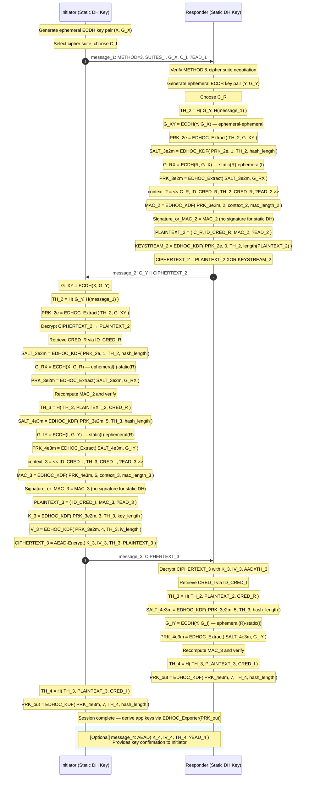
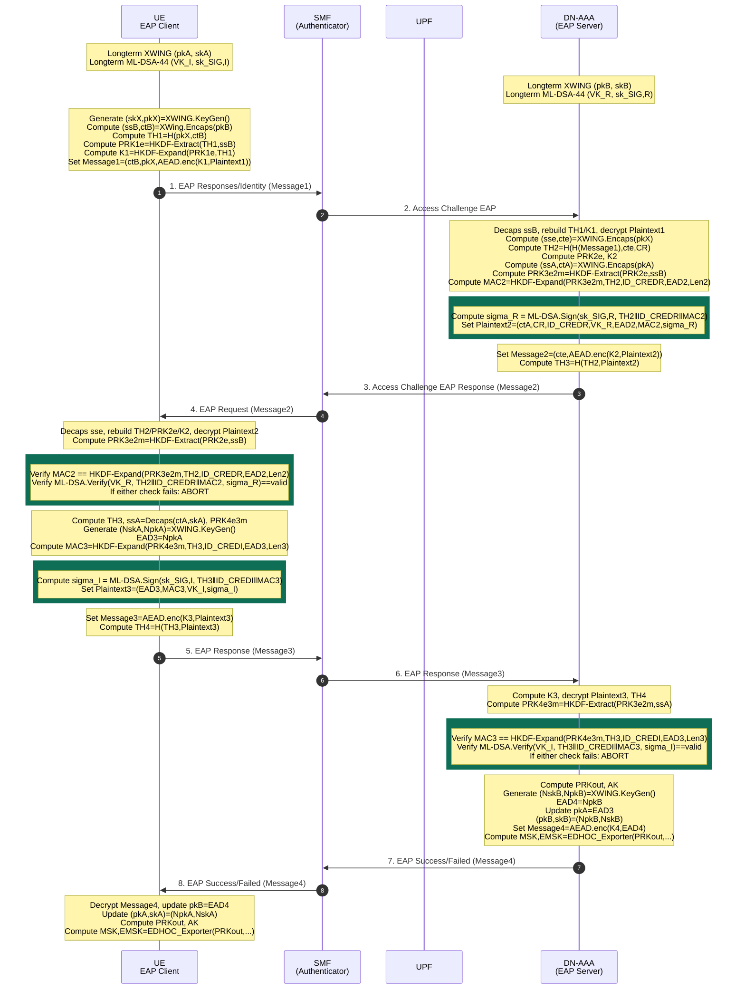

## 1) Type 0 Classic RFC 9528 (Signature Classic - Signature Classic)

```mermaid
sequenceDiagram
    autonumber
    participant I as Initiator (Sig Key)
    participant R as Responder (Sig Key)
 
    Note over I: Generate ephemeral ECDH key pair (X, G_X)
    Note over I: Select cipher suite, choose C_I
 
    I->>R: message_1: METHOD=0, SUITES_I, G_X, C_I, ?EAD_1
 
    Note over R: Verify METHOD & cipher suite negotiation
    Note over R: Generate ephemeral ECDH key pair (Y, G_Y)
    Note over R: Choose C_R
    Note over R: TH_2 = H( G_Y, H(message_1) )
    Note over R: G_XY = ECDH(Y, G_X)
    Note over R: PRK_2e = EDHOC_Extract( TH_2, G_XY )
    Note over R: PRK_3e2m = PRK_2e (no static DH for R in method 0)
    Note over R: context_2 = << C_R, ID_CRED_R, TH_2, CRED_R, ?EAD_2 >>
    Note over R: MAC_2 = EDHOC_KDF( PRK_3e2m, 2, context_2, hash_length )
    Note over R: Signature_or_MAC_2 = Sign( R; protected=<<ID_CRED_R>>,<br/>external_aad=<<TH_2,CRED_R,?EAD_2>>, payload=MAC_2 )
    Note over R: PLAINTEXT_2 = ( C_R, ID_CRED_R, Signature_or_MAC_2, ?EAD_2 )
    Note over R: KEYSTREAM_2 = EDHOC_KDF( PRK_2e, 0, TH_2, length(PLAINTEXT_2) )
    Note over R: CIPHERTEXT_2 = PLAINTEXT_2 XOR KEYSTREAM_2
 
    R->>I: message_2: G_Y || CIPHERTEXT_2
 
    Note over I: G_XY = ECDH(X, G_Y)
    Note over I: TH_2 = H( G_Y, H(message_1) )
    Note over I: PRK_2e = EDHOC_Extract( TH_2, G_XY )
    Note over I: Decrypt CIPHERTEXT_2 → PLAINTEXT_2
    Note over I: Retrieve CRED_R via ID_CRED_R
    Note over I: PRK_3e2m = PRK_2e
    Note over I: Recompute MAC_2 and verify Signature_or_MAC_2
    Note over I: TH_3 = H( TH_2, PLAINTEXT_2, CRED_R )
    Note over I: PRK_4e3m = PRK_3e2m (no static DH for I in method 0)
    Note over I: context_3 = << ID_CRED_I, TH_3, CRED_I, ?EAD_3 >>
    Note over I: MAC_3 = EDHOC_KDF( PRK_4e3m, 6, context_3, hash_length )
    Note over I: Signature_or_MAC_3 = Sign( I; protected=<<ID_CRED_I>>,<br/>external_aad=<<TH_3,CRED_I,?EAD_3>>, payload=MAC_3 )
    Note over I: PLAINTEXT_3 = ( ID_CRED_I, Signature_or_MAC_3, ?EAD_3 )
    Note over I: K_3 = EDHOC_KDF( PRK_3e2m, 3, TH_3, key_length )
    Note over I: IV_3 = EDHOC_KDF( PRK_3e2m, 4, TH_3, iv_length )
    Note over I: CIPHERTEXT_3 = AEAD-Encrypt( K_3, IV_3, TH_3, PLAINTEXT_3 )
 
    I->>R: message_3: CIPHERTEXT_3
 
    Note over R: Decrypt CIPHERTEXT_3 with K_3, IV_3, AAD=TH_3
    Note over R: Retrieve CRED_I via ID_CRED_I
    Note over R: Recompute MAC_3 and verify Signature_or_MAC_3
    Note over R: TH_4 = H( TH_3, PLAINTEXT_3, CRED_I )
    Note over R: PRK_4e3m = PRK_3e2m
    Note over R: PRK_out = EDHOC_KDF( PRK_4e3m, 7, TH_4, hash_length )
 
    Note over I: TH_4 = H( TH_3, PLAINTEXT_3, CRED_I )
    Note over I: PRK_out = EDHOC_KDF( PRK_4e3m, 7, TH_4, hash_length )
 
    Note over I,R: Session complete — derive app keys via EDHOC_Exporter(PRK_out)
 
    rect rgb(240, 248, 255)
        Note over R,I: [Optional] message_4: AEAD( K_4, IV_4, TH_4, ?EAD_4 )<br/>Provides key confirmation to Initiator
    end
```

## 2) Type 1 Classic RFC 9528 (Static DH - Signature Classic)

```mermaid
sequenceDiagram
    autonumber
    participant I as Initiator (Sig Key)
    participant R as Responder (Static DH Key)
 
    Note over I: Generate ephemeral ECDH key pair (X, G_X)
    Note over I: Select cipher suite, choose C_I
 
    I->>R: message_1: METHOD=1, SUITES_I, G_X, C_I, ?EAD_1
 
    Note over R: Verify METHOD & cipher suite negotiation
    Note over R: Generate ephemeral ECDH key pair (Y, G_Y)
    Note over R: Choose C_R
    Note over R: TH_2 = H( G_Y, H(message_1) )
    Note over R: G_XY = ECDH(Y, G_X) — ephemeral-ephemeral
    Note over R: PRK_2e = EDHOC_Extract( TH_2, G_XY )
    Note over R: SALT_3e2m = EDHOC_KDF( PRK_2e, 1, TH_2, hash_length )
    Note over R: G_RX = ECDH(R, G_X) — static(R)-ephemeral(I)
    Note over R: PRK_3e2m = EDHOC_Extract( SALT_3e2m, G_RX )
    Note over R: context_2 = << C_R, ID_CRED_R, TH_2, CRED_R, ?EAD_2 >>
    Note over R: MAC_2 = EDHOC_KDF( PRK_3e2m, 2, context_2, mac_length_2 )
    Note over R: Signature_or_MAC_2 = MAC_2 (no signature for static DH)
    Note over R: PLAINTEXT_2 = ( C_R, ID_CRED_R, MAC_2, ?EAD_2 )
    Note over R: KEYSTREAM_2 = EDHOC_KDF( PRK_2e, 0, TH_2, length(PLAINTEXT_2) )
    Note over R: CIPHERTEXT_2 = PLAINTEXT_2 XOR KEYSTREAM_2
 
    R->>I: message_2: G_Y || CIPHERTEXT_2
 
    Note over I: G_XY = ECDH(X, G_Y)
    Note over I: TH_2 = H( G_Y, H(message_1) )
    Note over I: PRK_2e = EDHOC_Extract( TH_2, G_XY )
    Note over I: Decrypt CIPHERTEXT_2 → PLAINTEXT_2
    Note over I: Retrieve CRED_R via ID_CRED_R
    Note over I: SALT_3e2m = EDHOC_KDF( PRK_2e, 1, TH_2, hash_length )
    Note over I: G_RX = ECDH(X, G_R) — ephemeral(I)-static(R)
    Note over I: PRK_3e2m = EDHOC_Extract( SALT_3e2m, G_RX )
    Note over I: Recompute MAC_2 and verify
    Note over I: TH_3 = H( TH_2, PLAINTEXT_2, CRED_R )
    Note over I: PRK_4e3m = PRK_3e2m (no static DH for I in method 1)
    Note over I: context_3 = << ID_CRED_I, TH_3, CRED_I, ?EAD_3 >>
    Note over I: MAC_3 = EDHOC_KDF( PRK_4e3m, 6, context_3, hash_length )
    Note over I: Signature_or_MAC_3 = Sign( I; protected=<<ID_CRED_I>>,<br/>external_aad=<<TH_3,CRED_I,?EAD_3>>, payload=MAC_3 )
    Note over I: PLAINTEXT_3 = ( ID_CRED_I, Signature_or_MAC_3, ?EAD_3 )
    Note over I: K_3 = EDHOC_KDF( PRK_3e2m, 3, TH_3, key_length )
    Note over I: IV_3 = EDHOC_KDF( PRK_3e2m, 4, TH_3, iv_length )
    Note over I: CIPHERTEXT_3 = AEAD-Encrypt( K_3, IV_3, TH_3, PLAINTEXT_3 )
 
    I->>R: message_3: CIPHERTEXT_3
 
    Note over R: Decrypt CIPHERTEXT_3 with K_3, IV_3, AAD=TH_3
    Note over R: Retrieve CRED_I via ID_CRED_I
    Note over R: Recompute MAC_3 and verify Signature_or_MAC_3
    Note over R: TH_4 = H( TH_3, PLAINTEXT_3, CRED_I )
    Note over R: PRK_4e3m = PRK_3e2m
    Note over R: PRK_out = EDHOC_KDF( PRK_4e3m, 7, TH_4, hash_length )
 
    Note over I: TH_4 = H( TH_3, PLAINTEXT_3, CRED_I )
    Note over I: PRK_out = EDHOC_KDF( PRK_4e3m, 7, TH_4, hash_length )
 
    Note over I,R: Session complete — derive app keys via EDHOC_Exporter(PRK_out)
 
    rect rgb(240, 248, 255)
        Note over R,I: [Optional] message_4: AEAD( K_4, IV_4, TH_4, ?EAD_4 )<br/>Provides key confirmation to Initiator
    end
```


## 3) Type 2 Classic RFC 9528 (Static DH - Signature Classic)

```mermaid
sequenceDiagram
    autonumber
    participant I as Initiator (Static DH Key)
    participant R as Responder (Sig Key)
 
    Note over I: Generate ephemeral ECDH key pair (X, G_X)
    Note over I: Select cipher suite, choose C_I
 
    I->>R: message_1: METHOD=2, SUITES_I, G_X, C_I, ?EAD_1
 
    Note over R: Verify METHOD & cipher suite negotiation
    Note over R: Generate ephemeral ECDH key pair (Y, G_Y)
    Note over R: Choose C_R
    Note over R: TH_2 = H( G_Y, H(message_1) )
    Note over R: G_XY = ECDH(Y, G_X)
    Note over R: PRK_2e = EDHOC_Extract( TH_2, G_XY )
    Note over R: PRK_3e2m = PRK_2e (no static DH for R in method 2)
    Note over R: context_2 = << C_R, ID_CRED_R, TH_2, CRED_R, ?EAD_2 >>
    Note over R: MAC_2 = EDHOC_KDF( PRK_3e2m, 2, context_2, hash_length )
    Note over R: Signature_or_MAC_2 = Sign( R; protected=<<ID_CRED_R>>,<br/>external_aad=<<TH_2,CRED_R,?EAD_2>>, payload=MAC_2 )
    Note over R: PLAINTEXT_2 = ( C_R, ID_CRED_R, Signature_or_MAC_2, ?EAD_2 )
    Note over R: KEYSTREAM_2 = EDHOC_KDF( PRK_2e, 0, TH_2, length(PLAINTEXT_2) )
    Note over R: CIPHERTEXT_2 = PLAINTEXT_2 XOR KEYSTREAM_2
 
    R->>I: message_2: G_Y || CIPHERTEXT_2
 
    Note over I: G_XY = ECDH(X, G_Y)
    Note over I: TH_2 = H( G_Y, H(message_1) )
    Note over I: PRK_2e = EDHOC_Extract( TH_2, G_XY )
    Note over I: Decrypt CIPHERTEXT_2 → PLAINTEXT_2
    Note over I: Retrieve CRED_R via ID_CRED_R
    Note over I: PRK_3e2m = PRK_2e
    Note over I: Recompute MAC_2 and verify Signature_or_MAC_2
    Note over I: TH_3 = H( TH_2, PLAINTEXT_2, CRED_R )
    Note over I: SALT_4e3m = EDHOC_KDF( PRK_3e2m, 5, TH_3, hash_length )
    Note over I: G_IY = ECDH(I, G_Y) — static(I)-ephemeral(R)
    Note over I: PRK_4e3m = EDHOC_Extract( SALT_4e3m, G_IY )
    Note over I: context_3 = << ID_CRED_I, TH_3, CRED_I, ?EAD_3 >>
    Note over I: MAC_3 = EDHOC_KDF( PRK_4e3m, 6, context_3, mac_length_3 )
    Note over I: Signature_or_MAC_3 = MAC_3 (no signature for static DH)
    Note over I: PLAINTEXT_3 = ( ID_CRED_I, MAC_3, ?EAD_3 )
    Note over I: K_3 = EDHOC_KDF( PRK_3e2m, 3, TH_3, key_length )
    Note over I: IV_3 = EDHOC_KDF( PRK_3e2m, 4, TH_3, iv_length )
    Note over I: CIPHERTEXT_3 = AEAD-Encrypt( K_3, IV_3, TH_3, PLAINTEXT_3 )
 
    I->>R: message_3: CIPHERTEXT_3
 
    Note over R: Decrypt CIPHERTEXT_3 with K_3, IV_3, AAD=TH_3
    Note over R: Retrieve CRED_I via ID_CRED_I
    Note over R: TH_3 = H( TH_2, PLAINTEXT_2, CRED_R )
    Note over R: SALT_4e3m = EDHOC_KDF( PRK_3e2m, 5, TH_3, hash_length )
    Note over R: G_IY = ECDH(Y, G_I) — ephemeral(R)-static(I)
    Note over R: PRK_4e3m = EDHOC_Extract( SALT_4e3m, G_IY )
    Note over R: Recompute MAC_3 and verify
    Note over R: TH_4 = H( TH_3, PLAINTEXT_3, CRED_I )
    Note over R: PRK_out = EDHOC_KDF( PRK_4e3m, 7, TH_4, hash_length )
 
    Note over I: TH_4 = H( TH_3, PLAINTEXT_3, CRED_I )
    Note over I: PRK_out = EDHOC_KDF( PRK_4e3m, 7, TH_4, hash_length )
 
    Note over I,R: Session complete — derive app keys via EDHOC_Exporter(PRK_out)
 
    rect rgb(240, 248, 255)
        Note over R,I: [Optional] message_4: AEAD( K_4, IV_4, TH_4, ?EAD_4 )<br/>Provides key confirmation to Initiator
    end
```


## 4) Type 3 Classic RFC 9528 (Static DH - Static DH)



## 5. EAP-EDHOC Hybrid PQC (XWING) — SIGMA  (Initiator: SIGMA, Responder: SIGMA)

